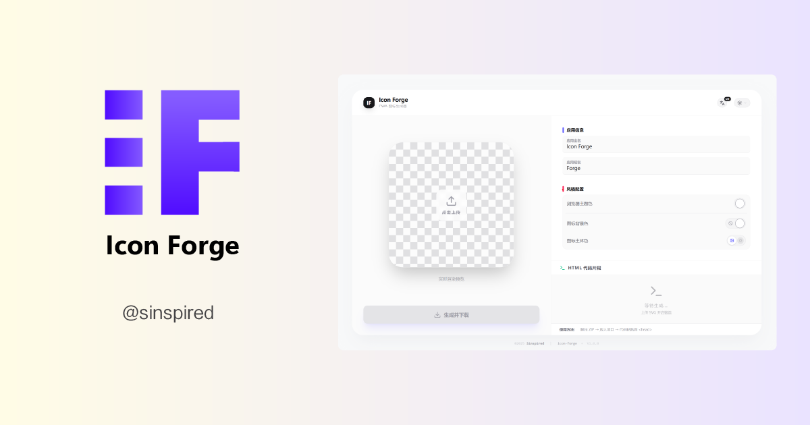

<div align="center">

<h1>🎨 Icon Forge</h1>
<strong>现代 Web / PWA 图标一站式生成器</strong>
</br>
<p>一键生成 <code>PWA</code> 与 <code>Web</code> 应用全套图标、<code>manifest</code> 以及可直接拷贝的 <code>HTML</code> 片段。</p>

<a href="https://nextjs.org/">
 
 </a>
<a href="https://tailwindcss.com/">
 
 </a>


<br/>
<br/>


</div>

## ✨ 功能特性

- [x] 🧩 自动处理上传的 `SVG` 图标，生成网页与 PWA 全套图标
- [x] 🗃️ 自动生成 `manifest.json` 以及可直接粘贴进项目的代码片段
- [x] 🎨 支持对 `SVG` 图片重新着色、替换背景
- [x] 🖼️ 支持处理 `png`, `ico`, `jpg`, `webp` 格式的图片

## 🚀 快速开始

### 克隆项目

```bash
git clone https://github.com/sinspired/icon-forge.git
cd icon-forge

pnpm install
```

### 启动开发服务器

```bash
pnpm dev
```

访问 <http://localhost:3000>

## 🛠️ 部署

点击下方按钮，一键部署到你的 `Vercel` 账户

[](https://vercel.com/new/clone?repository-url=https://github.com/sinspired/icon-forge)
